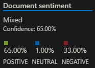
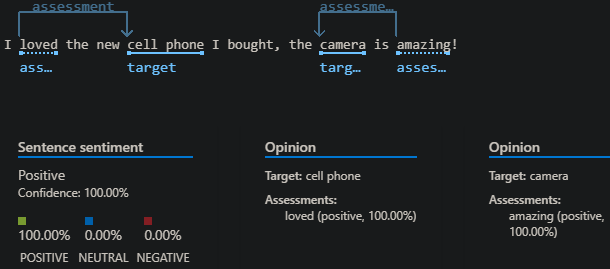
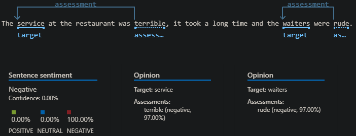
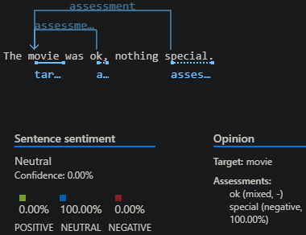
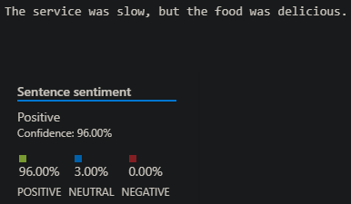

# Análise de Sentimentos com Azure AI Language Studio

Este repositório contém uma prática de Análise de Sentimentos utilizando o Azure Language Studio, como parte do bootcamp Decola Tech 2025.

## :file_folder: Estrutura do Projeto
- `inputs/sentences.txt`: Documento com as sentenças analisadas pela IA.
- `prints/`: Capturas de tela do processo no Language Studio.
- `README.md`: Descrição do projeto, processo e aprendizados.

## :gear: Processo
1. Criei um arquivo com algumas sentenças com diferentes emoções (positiva, negativa, neutra e mista).
2. No Azure Language Studio, utilizei a funcionalidade de "Sentiment Analysis".
3. Fiz o upload do arquivo de entrada.
4. A IA analisou e retornou os sentimentos de cada frase.
5. Capturei os resultados e salvei alguns prints.

## :brain: Insights e Possibilidades
- A IA consegue identificar nuances emocionais muito bem, inclusive frases com sentimentos mistos.
- É possível expandir esse uso para analisar avaliações de produtos, feedbacks de clientes ou até posts em redes sociais.
- Essa ferramenta pode ser usada para classificar grandes volumes de texto automaticamente, economizando muito tempo em análises manuais.

## :camera: Prints

